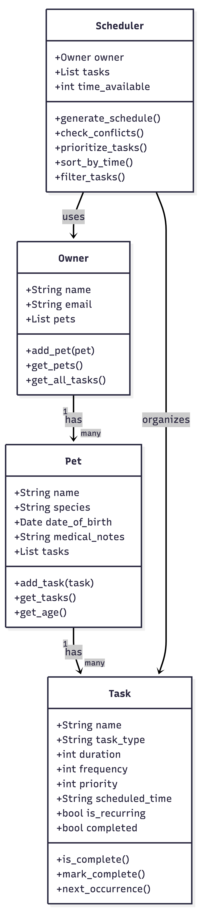

# 🐾 PawPal+ (Module 2 Project)

You are building **PawPal+**, a Streamlit app that helps a pet owner
plan care tasks for their pet.

## Scenario

A busy pet owner needs help staying consistent with pet care. They 
want an assistant that can:

- Track pet care tasks (walks, feeding, meds, enrichment, grooming)
- Consider constraints (time available, priority, owner preferences)
- Produce a daily plan and explain why it chose that plan

## Features

- **Owner & Pet Management:** Add multiple pets with species, date of 
  birth, and medical notes. Age is calculated automatically.
- **Smart Task Scheduling:** Tasks are prioritized by importance and 
  fit within the owner's available time for the day.
- **Conflict Detection:** Warns the owner if two tasks for the same 
  pet are scheduled at the same time.
- **Sorting & Filtering:** Tasks can be sorted by time or filtered 
  by pet and completion status.
- **Recurring Tasks:** When a task is marked complete, the next 
  occurrence is automatically created.
- **Time Picker:** Easy AM/PM time selection with support for 
  multiple time slots when a task occurs more than once a day.

## System Architecture



## Getting Started

### Setup
```bash
python -m venv .venv
source .venv/bin/activate
pip install -r requirements.txt
```

### Run the App
```bash
streamlit run app.py
```

### Run Tests
```bash
python -m pytest -v
```

Tests cover task completion, pet task addition, sorting, recurring 
tasks, conflict detection, and cross-pet scheduling.

Confidence level: ⭐⭐⭐⭐ (4/5)

## Suggested Workflow

1. Save owner info and set available time
2. Add your pets
3. Add care tasks with priorities and times
4. Generate the daily schedule
5. Check off tasks as you complete them

## Optional Extensions

- ✅ Challenge 2: Data Persistence (auto-saves to data.json)
- ✅ Challenge 3: Priority-Based Color Coding (🔴🟡🟢)
- ✅ Challenge 4: Professional UI with emojis, tabs, and checkboxes
- ✅ Challenge 1: Next Available Slot algorithm — automatically suggests alternative times when scheduling conflicts are detected

## Demo

<a href="/course_images/ai110/demo_screenshot2.png" target="_blank"></a>